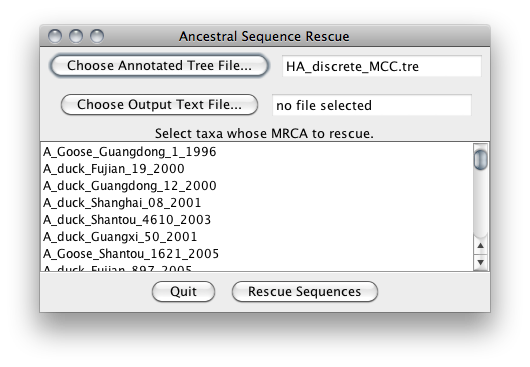

# Ancestral Sequence Rescue

A utility that rescues reconstructed ancestral sequences (and other node attributes) from [BEAST](http://beast.bio.ed.ac.uk/) analyses.

[**DOWNLOAD**](http://github.com/armanbilge/AncestralSequenceRescue/releases)

